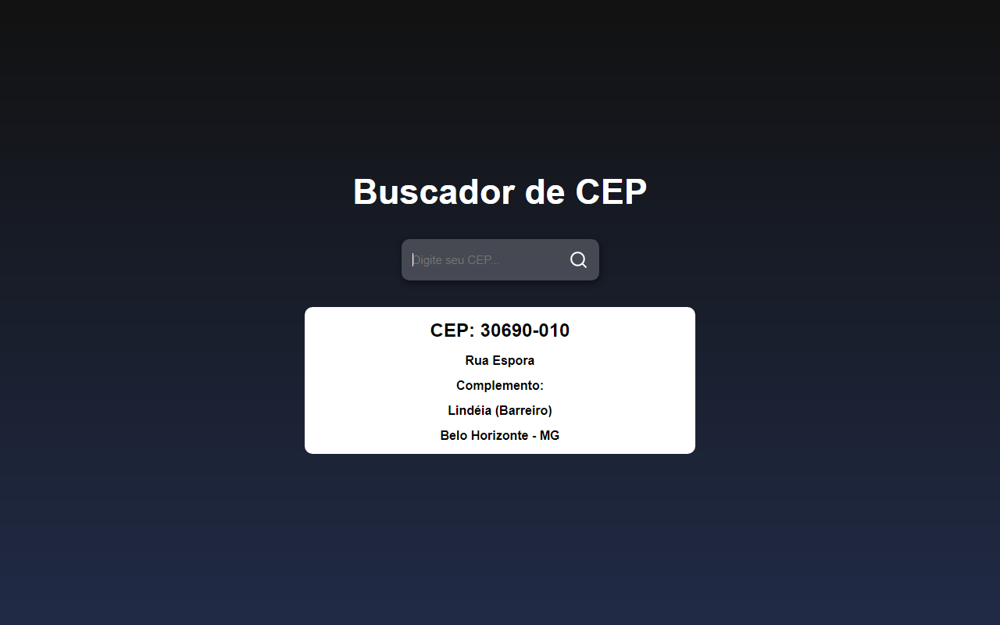

<h1 align='center'>Buscador de Cep</1>
 
 

 

<h2 align='center'>Descrição</h2> 

**Projeto** criado com **React.JS** para reforçar os conhecimentos e tbm aprender a ultilização de API nas aplicações .

 

<h2 align='center'>Sobre</h2>

No **Projeto** voce adicona o CEP desejado onde irá trazer as informaçoes da API, logo após irá aparecer a Rua, Complemento, Bairro e o estado .
 

### **Tecnologias usadas** ->
 

- [HTML]()
- [CSS]()
- [JAVASCRIPT]()
- [REACT.JS]()

